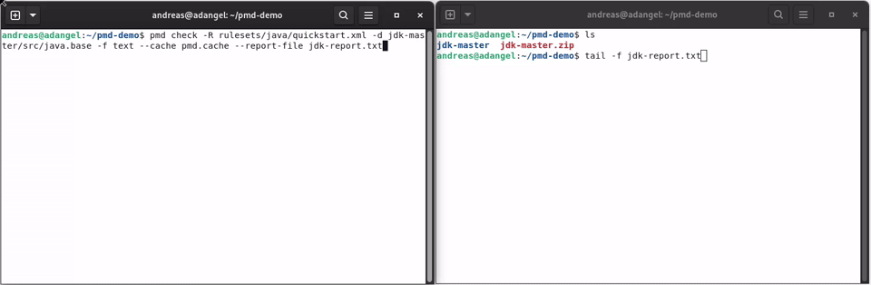

# PMD - source code analyzer

 

**PMD** is a source code analyzer. It finds common programming flaws like unused variables, empty catch blocks,
unnecessary object creation, and so forth. It supports many languages. It can be extended with custom rules.
It uses JavaCC and Antlr to parse source files into abstract syntax trees (AST) and runs rules against them to find violations.
Rules can be written in Java or using a XPath query.

It supports Java, JavaScript, Salesforce.com Apex and Visualforce,
Modelica, PLSQL, Apache Velocity, XML, XSL, Scala.

Additionally it includes **CPD**, the copy-paste-detector. CPD finds duplicated code in
C/C++, C#, Dart, Fortran, Go, Groovy, Java, JavaScript, JSP, Kotlin, Lua, Matlab, Modelica,
Objective-C, Perl, PHP, PLSQL, Python, Ruby, Salesforce.com Apex, Scala, Swift, Visualforce and XML.

In the future we hope to add support for data/control flow analysis and automatic (quick) fixes where
it makes sense.

## 🚀 Installation and Usage

Download the latest binary zip from the [releases](https://github.com/pmd/pmd/releases/latest)
and extract it somewhere.

Execute `bin/run.sh pmd` or `bin\pmd.bat`.

See also [Getting Started](https://pmd.github.io/latest/pmd_userdocs_installation.html)

**Demo:**

This shows how PMD can detect for loops, that can be replaced by for-each loops.

There are plugins for Maven and Gradle as well as for various IDEs.
See [Tools / Integrations](https://pmd.github.io/latest/pmd_userdocs_tools.html)

## ℹ️ How to get support?

*   How do I? -- Ask a question on [StackOverflow](https://stackoverflow.com/questions/tagged/pmd)
    or on [discussions](https://github.com/pmd/pmd/discussions).
*   I got this error, why? -- Ask a question on [StackOverflow](https://stackoverflow.com/questions/tagged/pmd)
    or on [discussions](https://github.com/pmd/pmd/discussions).
*   I got this error and I'm sure it's a bug -- file an [issue](https://github.com/pmd/pmd/issues).
*   I have an idea/request/question -- create a new [discussion](https://github.com/pmd/pmd/discussions).
*   I have a quick question -- ask on our [Gitter chat](https://gitter.im/pmd/pmd).
*   Where's your documentation? -- <https://pmd.github.io/latest/>

## 🤝 Contributing

Pull requests are welcome. For major changes, please open an issue first to discuss what you would like to change.

Our latest source of PMD can be found on [GitHub](https://github.com/pmd/pmd). Fork us!

*   [How to build PMD](BUILDING.md)
*   [How to contribute to PMD](CONTRIBUTING.md)

The rule designer is developed over at [pmd/pmd-designer](https://github.com/pmd/pmd-designer).
Please see [its README](https://github.com/pmd/pmd-designer#contributing) for
developer documentation.

## 🪙 Financial Contributors

Become a financial contributor and help us sustain our community. [Contribute](https://opencollective.com/pmd/contribute)

## ✨ Contributors

Thanks goes to these wonderful people ([emoji key](https://allcontributors.org/docs/en/emoji-key)):

<!-- ALL-CONTRIBUTORS-LIST:START - Do not remove or modify this section -->
<!-- prettier-ignore-start -->
<!-- markdownlint-disable -->
<table>
  <tr>
    <td align="center"><a href="https://github.com/0xflotus"> <b>0xflotus</b></a> <a href="https://github.com/pmd/pmd/commits?author=0xflotus" title="Code">💻</a></td>
    <td align="center"><a href="https://github.com/akshatbahety"> <b>Akshat Bahety</b></a> <a href="https://github.com/pmd/pmd/commits?author=akshatbahety" title="Code">💻</a></td>
    <td align="center"><a href="https://github.com/albfernandez"> <b>Alberto Fernández</b></a> <a href="https://github.com/pmd/pmd/commits?author=albfernandez" title="Code">💻</a></td>
    <td align="center"><a href="https://github.com/vovkss"> <b>Alex Shesterov</b></a> <a href="https://github.com/pmd/pmd/commits?author=vovkss" title="Code">💻</a></td>
    <td align="center"><a href="https://github.com/anand13s"> <b>Anand Subramanian</b></a> <a href="https://github.com/pmd/pmd/commits?author=anand13s" title="Code">💻</a></td>
    <td align="center"><a href="https://atrosinenko.github.io/"> <b>Anatoly Trosinenko</b></a> <a href="https://github.com/pmd/pmd/commits?author=atrosinenko" title="Code">💻</a></td>
    <td align="center"><a href="https://github.com/andipabst"> <b>Andi Pabst</b></a> <a href="https://github.com/pmd/pmd/commits?author=andipabst" title="Code">💻</a></td>
  </tr>
  <tr>
    <td align="center"><a href="https://github.com/adangel"> <b>Andreas Dangel</b></a> <a href="https://github.com/pmd/pmd/commits?author=adangel" title="Code">💻</a> <a href="https://github.com/pmd/pmd/commits?author=adangel" title="Documentation">📖</a></td>
    <td align="center"><a href="https://www.linkedin.com/in/andrey-mochalov-063751108/?locale=en_US"> <b>Andrey Mochalov</b></a> <a href="https://github.com/pmd/pmd/commits?author=epidemia" title="Code">💻</a></td>
    <td align="center"><a href="https://github.com/ajeans"> <b>Arnaud Jeansen</b></a> <a href="https://github.com/pmd/pmd/commits?author=ajeans" title="Code">💻</a></td>
    <td align="center"><a href="https://kroartem.wordpress.com/"> <b>Artem</b></a> <a href="https://github.com/pmd/pmd/commits?author=KroArtem" title="Code">💻</a></td>
    <td align="center"><a href="https://github.com/djydewang"> <b>BBG</b></a> <a href="https://github.com/pmd/pmd/commits?author=djydewang" title="Code">💻</a> <a href="https://github.com/pmd/pmd/commits?author=djydewang" title="Documentation">📖</a></td>
    <td align="center"><a href="https://github.com/pamidi99"> <b>Bhanu Prakash Pamidi</b></a> <a href="https://github.com/pmd/pmd/commits?author=pamidi99" title="Code">💻</a></td>
    <td align="center"><a href="https://github.com/Vampire"> <b>Björn Kautler</b></a> <a href="https://github.com/pmd/pmd/commits?author=Vampire" title="Code">💻</a></td>
  </tr>
  <tr>
    <td align="center"><a href="https://github.com/refactormyself"> <b>Bolarinwa Saheed Olayemi</b></a> <a href="https://github.com/pmd/pmd/commits?author=refactormyself" title="Code">💻</a></td>
    <td align="center"><a href="https://blog.arkey.fr/"> <b>Brice Dutheil</b></a> <a href="https://github.com/pmd/pmd/commits?author=bric3" title="Code">💻</a></td>
    <td align="center"><a href="https://github.com/chrisdutz"> <b>Christofer Dutz</b></a> <a href="https://github.com/pmd/pmd/commits?author=chrisdutz" title="Code">💻</a></td>
    <td align="center"><a href="https://github.com/Clint-Chester"> <b>Clint Chester</b></a> <a href="https://github.com/pmd/pmd/commits?author=Clint-Chester" title="Code">💻</a></td>
    <td align="center"><a href="https://github.com/oowekyala"> <b>Clément Fournier</b></a> <a href="https://github.com/pmd/pmd/commits?author=oowekyala" title="Code">💻</a> <a href="https://github.com/pmd/pmd/commits?author=oowekyala" title="Documentation">📖</a></td>
    <td align="center"><a href="https://github.com/CyrilSicard"> <b>Cyril</b></a> <a href="https://github.com/pmd/pmd/commits?author=CyrilSicard" title="Code">💻</a></td>
    <td align="center"><a href="https://github.com/daleanson"> <b>Dale</b></a> <a href="https://github.com/pmd/pmd/commits?author=daleanson" title="Code">💻</a></td>
  </tr>
  <tr>
    <td align="center"><a href="https://github.com/davidburstromspotify"> <b>David Burström</b></a> <a href="https://github.com/pmd/pmd/commits?author=davidburstromspotify" title="Code">💻</a></td>
    <td align="center"><a href="https://github.com/DavidRenz"> <b>David Renz</b></a> <a href="https://github.com/pmd/pmd/commits?author=DavidRenz" title="Code">💻</a></td>
    <td align="center"><a href="https://github.com/borovikovd"> <b>Denis Borovikov</b></a> <a href="https://github.com/pmd/pmd/commits?author=borovikovd" title="Code">💻</a></td>
    <td align="center"><a href="https://github.com/dreniers"> <b>Dennie Reniers</b></a> <a href="https://github.com/pmd/pmd/commits?author=dreniers" title="Code">💻</a></td>
    <td align="center"><a href="https://github.com/dionisioC"> <b>Dionisio Cortés Fernández</b></a> <a href="https://github.com/pmd/pmd/commits?author=dionisioC" title="Code">💻</a></td>
    <td align="center"><a href="http://www.filipesperandio.com/"> <b>Filipe Esperandio</b></a> <a href="https://github.com/pmd/pmd/commits?author=filipesperandio" title="Code">💻</a></td>
    <td align="center"><a href="http://domui.org/"> <b>Frits Jalvingh</b></a> <a href="https://github.com/pmd/pmd/commits?author=fjalvingh" title="Code">💻</a></td>
  </tr>
  <tr>
    <td align="center"><a href="https://github.com/gibarsin"> <b>Gonzalo Exequiel Ibars Ingman</b></a> <a href="https://github.com/pmd/pmd/commits?author=gibarsin" title="Code">💻</a></td>
    <td align="center"><a href="https://github.com/GuntherSchrijvers"> <b>Gunther Schrijvers</b></a> <a href="https://github.com/pmd/pmd/commits?author=GuntherSchrijvers" title="Code">💻</a></td>
    <td align="center"><a href="http://about.me/hgschmie"> <b>Henning Schmiedehausen</b></a> <a href="https://github.com/pmd/pmd/commits?author=hgschmie" title="Code">💻</a></td>
    <td align="center"><a href="https://github.com/hvbargen"> <b>Henning von Bargen</b></a> <a href="https://github.com/pmd/pmd/commits?author=hvbargen" title="Code">💻</a></td>
    <td align="center"><a href="https://github.com/hooperbloob"> <b>Hooperbloob</b></a> <a href="https://github.com/pmd/pmd/commits?author=hooperbloob" title="Code">💻</a></td>
    <td align="center"><a href="https://github.com/IDoCodingStuffs"> <b>IDoCodingStuffs</b></a> <a href="https://github.com/pmd/pmd/commits?author=IDoCodingStuffs" title="Code">💻</a></td>
    <td align="center"><a href="https://www.linkedin.com/in/janaertgeerts/"> <b>Jan Aertgeerts</b></a> <a href="https://github.com/pmd/pmd/commits?author=JAertgeerts" title="Code">💻</a></td>
  </tr>
  <tr>
    <td align="center"><a href="https://github.com/jbartolotta-sfdc"> <b>Jeff Bartolotta</b></a> <a href="https://github.com/pmd/pmd/commits?author=jbartolotta-sfdc" title="Code">💻</a></td>
    <td align="center"><a href="https://github.com/jeffhube"> <b>Jeff Hube</b></a> <a href="https://github.com/pmd/pmd/commits?author=jeffhube" title="Code">💻</a></td>
    <td align="center"><a href="https://github.com/John-Teng"> <b>John-Teng</b></a> <a href="https://github.com/pmd/pmd/commits?author=John-Teng" title="Code">💻</a></td>
    <td align="center"><a href="https://darakian.github.io/"> <b>Jon Moroney</b></a> <a href="https://github.com/pmd/pmd/commits?author=darakian" title="Code">💻</a></td>
    <td align="center"><a href="https://github.com/jonathanwiesel"> <b>Jonathan Wiesel</b></a> <a href="https://github.com/pmd/pmd/commits?author=jonathanwiesel" title="Code">💻</a></td>
    <td align="center"><a href="https://www.linkedin.com/in/joseph-allen-9602671/"> <b>Joseph</b></a> <a href="https://github.com/pmd/pmd/commits?author=JosephAllen" title="Code">💻</a></td>
    <td align="center"><a href="https://github.com/jfeingold35"> <b>Josh Feingold</b></a> <a href="https://github.com/pmd/pmd/commits?author=jfeingold35" title="Code">💻</a></td>
  </tr>
  <tr>
    <td align="center"><a href="https://github.com/jtjeferreira"> <b>João Ferreira</b></a> <a href="https://github.com/pmd/pmd/commits?author=jtjeferreira" title="Code">💻</a></td>
    <td align="center"><a href="https://github.com/jsotuyod"> <b>Juan Martín Sotuyo Dodero</b></a> <a href="https://github.com/pmd/pmd/commits?author=jsotuyod" title="Code">💻</a> <a href="https://github.com/pmd/pmd/commits?author=jsotuyod" title="Documentation">📖</a></td>
    <td align="center"><a href="https://github.com/clem0110"> <b>Kirk Clemens</b></a> <a href="https://github.com/pmd/pmd/commits?author=clem0110" title="Code">💻</a></td>
    <td align="center"><a href="https://github.com/kris-scheibe"> <b>Kris Scheibe</b></a> <a href="https://github.com/pmd/pmd/commits?author=kris-scheibe" title="Code">💻</a></td>
    <td align="center"><a href="https://www.linkedin.com/in/larry-diamond-3964042/"> <b>Larry Diamond</b></a> <a href="https://github.com/pmd/pmd/commits?author=larrydiamond" title="Code">💻</a></td>
    <td align="center"><a href="https://github.com/lsoncini"> <b>Lucas Soncini</b></a> <a href="https://github.com/pmd/pmd/commits?author=lsoncini" title="Code">💻</a></td>
    <td align="center"><a href="https://pmd.github.io/"> <b>Machine account for PMD</b></a> <a href="https://github.com/pmd/pmd/commits?author=pmd-bot" title="Code">💻</a></td>
  </tr>
  <tr>
    <td align="center"><a href="https://github.com/maikelsteneker"> <b>Maikel Steneker</b></a> <a href="https://github.com/pmd/pmd/commits?author=maikelsteneker" title="Code">💻</a></td>
    <td align="center"><a href="https://www.linkedin.com/in/manuel-moya-ferrer-11163168/"> <b>Manuel Moya Ferrer</b></a> <a href="https://github.com/pmd/pmd/commits?author=mmoyaferrer" title="Code">💻</a></td>
    <td align="center"><a href="https://github.com/markhall82"> <b>Mark Hall</b></a> <a href="https://github.com/pmd/pmd/commits?author=markhall82" title="Code">💻</a></td>
    <td align="center"><a href="https://github.com/MatiasComercio"> <b>MatiasComercio</b></a> <a href="https://github.com/pmd/pmd/commits?author=MatiasComercio" title="Code">💻</a></td>
    <td align="center"><a href="https://github.com/matifraga"> <b>Matías Fraga</b></a> <a href="https://github.com/pmd/pmd/commits?author=matifraga" title="Code">💻</a></td>
    <td align="center"><a href="https://github.com/marob"> <b>Maxime Robert</b></a> <a href="https://github.com/pmd/pmd/commits?author=marob" title="Code">💻</a></td>
    <td align="center"><a href="https://github.com/Drofff"> <b>Mykhailo Palahuta</b></a> <a href="https://github.com/pmd/pmd/commits?author=Drofff" title="Code">💻</a></td>
  </tr>
  <tr>
    <td align="center"><a href="https://github.com/pyxide"> <b>Olivier Parent</b></a> <a href="https://github.com/pmd/pmd/commits?author=pyxide" title="Code">💻</a></td>
    <td align="center"><a href="https://github.com/ollieabbey"> <b>Ollie Abbey</b></a> <a href="https://github.com/pmd/pmd/commits?author=ollieabbey" title="Code">💻</a></td>
    <td align="center"><a href="https://github.com/ozangulle"> <b>Ozan Gulle</b></a> <a href="https://github.com/pmd/pmd/commits?author=ozangulle" title="Code">💻</a></td>
    <td align="center"><a href="http://belaran.eu/wordpress/"> <b>Pelisse Romain</b></a> <a href="https://github.com/pmd/pmd/commits?author=rpelisse" title="Code">💻</a> <a href="https://github.com/pmd/pmd/commits?author=rpelisse" title="Documentation">📖</a></td>
    <td align="center"><a href="https://github.com/pchittum"> <b>Peter Chittum</b></a> <a href="https://github.com/pmd/pmd/commits?author=pchittum" title="Code">💻</a></td>
    <td align="center"><a href="https://github.com/acanda"> <b>Philip Graf</b></a> <a href="https://github.com/pmd/pmd/commits?author=acanda" title="Code">💻</a></td>
    <td align="center"><a href="https://github.com/pzygielo"> <b>Piotrek Żygieło</b></a> <a href="https://github.com/pmd/pmd/commits?author=pzygielo" title="Code">💻</a></td>
  </tr>
  <tr>
    <td align="center"><a href="https://github.com/rajeshggwp"> <b>RajeshR</b></a> <a href="https://github.com/pmd/pmd/commits?author=rajeshggwp" title="Code">💻</a></td>
    <td align="center"><a href="https://dogeforce.com/"> <b>Renato Oliveira</b></a> <a href="https://github.com/pmd/pmd/commits?author=renatoliveira" title="Code">💻</a></td>
    <td align="center"><a href="https://github.com/rmartinus"> <b>Robbie Martinus</b></a> <a href="https://github.com/pmd/pmd/commits?author=rmartinus" title="Code">💻</a></td>
    <td align="center"><a href="https://github.com/rsoesemann"> <b>Robert Sösemann</b></a> <a href="https://github.com/pmd/pmd/commits?author=rsoesemann" title="Code">💻</a> <a href="https://github.com/pmd/pmd/commits?author=rsoesemann" title="Documentation">📖</a> <a href="#talk-rsoesemann" title="Talks">📢</a></td>
    <td align="center"><a href="https://www.whatsthistimestamp.com/"> <b>Robin Stocker</b></a> <a href="https://github.com/pmd/pmd/commits?author=robinst" title="Code">💻</a></td>
    <td align="center"><a href="https://github.com/rsalvador"> <b>Roman Salvador</b></a> <a href="https://github.com/pmd/pmd/commits?author=rsalvador" title="Code">💻</a></td>
    <td align="center"><a href="https://github.com/xuthus"> <b>Sergey Yanzin</b></a> <a href="https://github.com/pmd/pmd/commits?author=xuthus" title="Code">💻</a></td>
  </tr>
  <tr>
    <td align="center"><a href="https://github.com/prophet1906"> <b>Shubham</b></a> <a href="https://github.com/pmd/pmd/commits?author=prophet1906" title="Code">💻</a></td>
    <td align="center"><a href="http://www.tiobe.com/"> <b>TIOBE Software</b></a> <a href="https://github.com/pmd/pmd/commits?author=tiobe" title="Code">💻</a></td>
    <td align="center"><a href="https://github.com/DTecheira"> <b>Techeira Damián</b></a> <a href="https://github.com/pmd/pmd/commits?author=DTecheira" title="Code">💻</a></td>
    <td align="center"><a href="https://github.com/Snap252"> <b>Thomas Smith</b></a> <a href="https://github.com/pmd/pmd/commits?author=Snap252" title="Code">💻</a></td>
    <td align="center"><a href="https://github.com/Thunderforge"> <b>Thunderforge</b></a> <a href="https://github.com/pmd/pmd/commits?author=Thunderforge" title="Code">💻</a></td>
    <td align="center"><a href="https://miranda-ng.org/"> <b>Tobias Weimer</b></a> <a href="https://github.com/pmd/pmd/commits?author=tweimer" title="Code">💻</a></td>
    <td align="center"><a href="https://github.com/tomidelucca"> <b>Tomi De Lucca</b></a> <a href="https://github.com/pmd/pmd/commits?author=tomidelucca" title="Code">💻</a></td>
  </tr>
  <tr>
    <td align="center"><a href="https://github.com/utkuc"> <b>Utku Cuhadaroglu</b></a> <a href="https://github.com/pmd/pmd/commits?author=utkuc" title="Code">💻</a></td>
    <td align="center"><a href="https://github.com/YodaDaCoda"> <b>William Brockhus</b></a> <a href="https://github.com/pmd/pmd/commits?author=YodaDaCoda" title="Code">💻</a></td>
    <td align="center"><a href="http://xenoamess.com/"> <b>XenoAmess</b></a> <a href="https://github.com/pmd/pmd/commits?author=XenoAmess" title="Code">💻</a></td>
    <td align="center"><a href="https://github.com/YYoungC"> <b>Young Chan</b></a> <a href="https://github.com/pmd/pmd/commits?author=YYoungC" title="Code">💻</a></td>
    <td align="center"><a href="https://github.com/andrey81inmd"> <b>andrey81inmd</b></a> <a href="https://github.com/pmd/pmd/commits?author=andrey81inmd" title="Code">💻</a></td>
    <td align="center"><a href="https://github.com/astillich-igniti"> <b>astillich-igniti</b></a> <a href="https://github.com/pmd/pmd/commits?author=astillich-igniti" title="Code">💻</a></td>
    <td align="center"><a href="https://github.com/berkam"> <b>berkam</b></a> <a href="https://github.com/pmd/pmd/commits?author=berkam" title="Code">💻</a></td>
  </tr>
  <tr>
    <td align="center"><a href="https://github.com/apps/dependabot"> <b>dependabot[bot]</b></a> <a href="https://github.com/pmd/pmd/commits?author=dependabot[bot]" title="Code">💻</a></td>
    <td align="center"><a href="https://github.com/gwilymatgearset"> <b>gwilymatgearset</b></a> <a href="https://github.com/pmd/pmd/commits?author=gwilymatgearset" title="Code">💻</a></td>
    <td align="center"><a href="https://github.com/hvbtup"> <b>hvbtup</b></a> <a href="https://github.com/pmd/pmd/commits?author=hvbtup" title="Code">💻</a></td>
    <td align="center"><a href="https://github.com/josemanuelrolon"> <b>josemanuelrolon</b></a> <a href="https://github.com/pmd/pmd/commits?author=josemanuelrolon" title="Code">💻</a></td>
    <td align="center"><a href="https://github.com/kabroxiko"> <b>kabroxiko</b></a> <a href="https://github.com/pmd/pmd/commits?author=kabroxiko" title="Code">💻</a></td>
    <td align="center"><a href="https://github.com/kenji21"> <b>kenji21</b></a> <a href="https://github.com/pmd/pmd/commits?author=kenji21" title="Code">💻</a></td>
    <td align="center"><a href="https://github.com/orimarko"> <b>orimarko</b></a> <a href="https://github.com/pmd/pmd/commits?author=orimarko" title="Code">💻</a></td>
  </tr>
  <tr>
    <td align="center"><a href="https://github.com/piotrszymanski-sc"> <b>piotrszymanski-sc</b></a> <a href="https://github.com/pmd/pmd/commits?author=piotrszymanski-sc" title="Code">💻</a></td>
    <td align="center"><a href="https://github.com/reudismam"> <b>reudismam</b></a> <a href="https://github.com/pmd/pmd/commits?author=reudismam" title="Code">💻</a></td>
    <td align="center"><a href="https://github.com/rmohan20"> <b>rmohan20</b></a> <a href="https://github.com/pmd/pmd/commits?author=rmohan20" title="Code">💻</a></td>
    <td align="center"><a href="https://github.com/ryan-gustafson"> <b>ryan-gustafson</b></a> <a href="https://github.com/pmd/pmd/commits?author=ryan-gustafson" title="Code">💻</a></td>
    <td align="center"><a href="https://github.com/sergeygorbaty"> <b>sergeygorbaty</b></a> <a href="https://github.com/pmd/pmd/commits?author=sergeygorbaty" title="Code">💻</a></td>
    <td align="center"><a href="https://github.com/sturton"> <b>sturton</b></a> <a href="https://github.com/pmd/pmd/commits?author=sturton" title="Code">💻</a></td>
    <td align="center"><a href="https://github.com/testation21"> <b>testation21</b></a> <a href="https://github.com/pmd/pmd/commits?author=testation21" title="Code">💻</a></td>
  </tr>
  <tr>
    <td align="center"><a href="https://github.com/xnYi9wRezm"> <b>xnYi9wRezm</b></a> <a href="https://github.com/pmd/pmd/commits?author=xnYi9wRezm" title="Code">💻</a></td>
    <td align="center"><a href="https://github.com/zgrzyt93"> <b>zgrzyt93</b></a> <a href="https://github.com/pmd/pmd/commits?author=zgrzyt93" title="Code">💻</a></td>
  </tr>
</table>

<!-- markdownlint-restore -->
<!-- prettier-ignore-end -->

<!-- ALL-CONTRIBUTORS-LIST:END -->

This project follows the [all-contributors](https://github.com/all-contributors/all-contributors) specification. Contributions of any kind welcome!

## 📝 License

[BSD Style](LICENSE)
