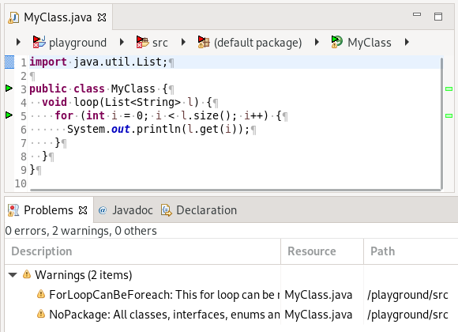

# PMD - source code analyzer

[](https://gitter.im/pmd/pmd?utm_source=badge&utm_medium=badge&utm_campaign=pr-badge&utm_content=badge)
[](https://github.com/pmd/pmd/actions)
[](https://maven-badges.herokuapp.com/maven-central/net.sourceforge.pmd/pmd)
[](https://github.com/jvm-repo-rebuild/reproducible-central#net.sourceforge.pmd:pmd)
[](https://coveralls.io/github/pmd/pmd)
[](https://www.codacy.com/app/pmd/pmd?utm_source=github.com&amp;utm_medium=referral&amp;utm_content=pmd/pmd&amp;utm_campaign=Badge_Grade)
[](code_of_conduct.md) 
[](https://pmd.github.io/latest/)

**PMD** is a source code analyzer. It finds common programming flaws like unused variables, empty catch blocks,
unnecessary object creation, and so forth. It supports many languages. It can be extended with custom rules.
It uses JavaCC and Antlr for parsing source into AST and runs rules against it to find violations.
Rules can be written in Java or using a XPath query.

It supports Java, JavaScript, Salesforce.com Apex and Visualforce,
Modelica, PLSQL, Apache Velocity, XML, XSL, Scala.

Additionally it includes **CPD**, the copy-paste-detector. CPD finds duplicated code in
C/C++, C#, Dart, Fortran, Go, Groovy, Java, JavaScript, JSP, Kotlin, Lua, Matlab, Modelica,
Objective-C, Perl, PHP, PLSQL, Python, Ruby, Salesforce.com Apex, Scala, Swift, Visualforce and XML.

In the future we hope to add support for data/control flow analysis and automatic (quick) fixes where
it makes sense.

## 🚀 Installation and Usage

Download the latest binary zip from the [releases](https://github.com/pmd/pmd/releases/latest)
and extract it somewhere.

Execute `bin/run.sh pmd` or `bin\pmd.bat`.

See also [Getting Started](https://pmd.github.io/latest/pmd_userdocs_installation.html)

**Demo:**

For this sample file:

```java
import java.util.List;

public class MyClass {
  void loop(List<String> l) {
    for (int i = 0; i < l.size(); i++) {
      System.out.println(l.get(i));
    }
  }
}
```

Run PMD on the command line:

```bash
$ run.sh pmd -d /usr/src -R rulesets/java/quickstart.xml -f xml
<?xml version="1.0" encoding="UTF-8"?>
<pmd xmlns="http://pmd.sourceforge.net/report/2.0.0" xmlns:xsi="http://www.w3.org/2001/XMLSchema-instance" xsi:schemaLocation="http://pmd.sourceforge.net/report/2.0.0 http://pmd.sourceforge.net/report_2_0_0.xsd" version="6.37.0" timestamp="2021-08-20T15:26:35.564">
<file name="/home/andreas/temp/pmd-test/MyClass.java">
<violation beginline="3" endline="9" begincolumn="1" endcolumn="1" rule="NoPackage" ruleset="Code Style" class="MyClass" externalInfoUrl="https://pmd.github.io/pmd-6.37.0/pmd_rules_java_codestyle.html#nopackage" priority="3">
All classes, interfaces, enums and annotations must belong to a named package
</violation>
<violation beginline="5" endline="7" begincolumn="5" endcolumn="5" rule="ForLoopCanBeForeach" ruleset="Best Practices" class="MyClass" method="loop" externalInfoUrl="https://pmd.github.io/pmd-6.37.0/pmd_rules_java_bestpractices.html#forloopcanbeforeach" priority="3">
This for loop can be replaced by a foreach loop
</violation>
</file>
</pmd>
```

PMD Eclipse Plugin:



There are plugins for Maven and Gradle as well as for various IDEs.
See [Tools / Integrations](https://pmd.github.io/latest/pmd_userdocs_tools.html)

## ℹ️ How to get support?

*   How do I? -- Ask a question on [StackOverflow](https://stackoverflow.com/questions/tagged/pmd)
    or on [discussions](https://github.com/pmd/pmd/discussions).
*   I got this error, why? -- Ask a question on [StackOverflow](https://stackoverflow.com/questions/tagged/pmd)
    or on [discussions](https://github.com/pmd/pmd/discussions).
*   I got this error and I'm sure it's a bug -- file an [issue](https://github.com/pmd/pmd/issues).
*   I have an idea/request/question -- create a new [discussion](https://github.com/pmd/pmd/discussions).
*   I have a quick question -- ask on our [Gitter chat](https://gitter.im/pmd/pmd).
*   Where's your documentation? -- <https://pmd.github.io/latest/>

## 🤝 Contributing

Pull requests are welcome. For major changes, please open an issue first to discuss what you would like to change.

Our latest source of PMD can be found on [GitHub](https://github.com/pmd/pmd). Fork us!

*   [How to build PMD](BUILDING.md)
*   [How to contribute to PMD](CONTRIBUTING.md)

The rule designer is developed over at [pmd/pmd-designer](https://github.com/pmd/pmd-designer).
Please see [its README](https://github.com/pmd/pmd-designer#contributing) for
developer documentation.

## 🪙 Financial Contributors

Become a financial contributor and help us sustain our community. [Contribute](https://opencollective.com/pmd/contribute)

## ✨ Contributors

Thanks goes to these wonderful people ([emoji key](https://allcontributors.org/docs/en/emoji-key)):

<!-- ALL-CONTRIBUTORS-LIST:START - Do not remove or modify this section -->
<!-- prettier-ignore-start -->
<!-- markdownlint-disable -->
<table>
  <tr>
    <td align="center"><a href="https://github.com/adangel"><br /><sub><b>Andreas Dangel</b></sub></a><br /><a href="https://github.com/pmd/pmd/commits?author=adangel" title="Code">💻</a> <a href="https://github.com/pmd/pmd/commits?author=adangel" title="Documentation">📖</a></td>
    <td align="center"><a href="https://www.linkedin.com/in/le-clement-fournier/"><br /><sub><b>Clément Fournier</b></sub></a><br /><a href="https://github.com/pmd/pmd/commits?author=oowekyala" title="Code">💻</a> <a href="https://github.com/pmd/pmd/commits?author=oowekyala" title="Documentation">📖</a></td>
    <td align="center"><a href="https://github.com/jsotuyod"><br /><sub><b>Juan Martín Sotuyo Dodero</b></sub></a><br /><a href="https://github.com/pmd/pmd/commits?author=jsotuyod" title="Code">💻</a> <a href="https://github.com/pmd/pmd/commits?author=jsotuyod" title="Documentation">📖</a></td>
    <td align="center"><a href="https://github.com/sergeygorbaty"><br /><sub><b>sergeygorbaty</b></sub></a><br /><a href="https://github.com/pmd/pmd/commits?author=sergeygorbaty" title="Code">💻</a></td>
    <td align="center"><a href="https://github.com/sturton"><br /><sub><b>sturton</b></sub></a><br /><a href="https://github.com/pmd/pmd/commits?author=sturton" title="Code">💻</a></td>
    <td align="center"><a href="https://github.com/rsoesemann"><br /><sub><b>Robert Sösemann</b></sub></a><br /><a href="https://github.com/pmd/pmd/commits?author=rsoesemann" title="Code">💻</a> <a href="https://github.com/pmd/pmd/commits?author=rsoesemann" title="Documentation">📖</a> <a href="#talk-rsoesemann" title="Talks">📢</a></td>
    <td align="center"><a href="https://github.com/maikelsteneker"><br /><sub><b>Maikel Steneker</b></sub></a><br /><a href="https://github.com/pmd/pmd/commits?author=maikelsteneker" title="Code">💻</a></td>
  </tr>
  <tr>
    <td align="center"><a href="https://github.com/gwilymatgearset"><br /><sub><b>gwilymatgearset</b></sub></a><br /><a href="https://github.com/pmd/pmd/commits?author=gwilymatgearset" title="Code">💻</a></td>
    <td align="center"><a href="https://github.com/akshatbahety"><br /><sub><b>Akshat Bahety</b></sub></a><br /><a href="https://github.com/pmd/pmd/commits?author=akshatbahety" title="Code">💻</a></td>
    <td align="center"><a href="https://www.linkedin.com/in/joseph-allen-9602671/"><br /><sub><b>Joseph</b></sub></a><br /><a href="https://github.com/pmd/pmd/commits?author=JosephAllen" title="Code">💻</a></td>
    <td align="center"><a href="https://github.com/DavidRenz"><br /><sub><b>David Renz</b></sub></a><br /><a href="https://github.com/pmd/pmd/commits?author=DavidRenz" title="Code">💻</a></td>
    <td align="center"><a href="http://belaran.eu/wordpress/"><br /><sub><b>Pelisse Romain</b></sub></a><br /><a href="https://github.com/pmd/pmd/commits?author=rpelisse" title="Code">💻</a> <a href="https://github.com/pmd/pmd/commits?author=rpelisse" title="Documentation">📖</a></td>
    <td align="center"><a href="https://github.com/Drofff"><br /><sub><b>Mykhailo Palahuta</b></sub></a><br /><a href="https://github.com/pmd/pmd/commits?author=Drofff" title="Code">💻</a></td>
    <td align="center"><a href="https://github.com/gibarsin"><br /><sub><b>Gonzalo Exequiel Ibars Ingman</b></sub></a><br /><a href="https://github.com/pmd/pmd/commits?author=gibarsin" title="Code">💻</a></td>
  </tr>
  <tr>
    <td align="center"><a href="https://github.com/djydewang"><br /><sub><b>BBG</b></sub></a><br /><a href="https://github.com/pmd/pmd/commits?author=djydewang" title="Code">💻</a> <a href="https://github.com/pmd/pmd/commits?author=djydewang" title="Documentation">📖</a></td>
    <td align="center"><a href="http://xenoamess.com/"><br /><sub><b>XenoAmess</b></sub></a><br /><a href="https://github.com/pmd/pmd/commits?author=XenoAmess" title="Code">💻</a></td>
    <td align="center"><a href="https://github.com/borovikovd"><br /><sub><b>Denis Borovikov</b></sub></a><br /><a href="https://github.com/pmd/pmd/commits?author=borovikovd" title="Code">💻</a></td>
    <td align="center"><a href="https://github.com/jeffhube"><br /><sub><b>Jeff Hube</b></sub></a><br /><a href="https://github.com/pmd/pmd/commits?author=jeffhube" title="Code">💻</a></td>
    <td align="center"><a href="https://github.com/piotrszymanski-sc"><br /><sub><b>piotrszymanski-sc</b></sub></a><br /><a href="https://github.com/pmd/pmd/commits?author=piotrszymanski-sc" title="Code">💻</a></td>
    <td align="center"><a href="https://github.com/kris-scheibe"><br /><sub><b>Kris Scheibe</b></sub></a><br /><a href="https://github.com/pmd/pmd/commits?author=kris-scheibe" title="Code">💻</a></td>
    <td align="center"><a href="https://github.com/jonathanwiesel"><br /><sub><b>Jonathan Wiesel</b></sub></a><br /><a href="https://github.com/pmd/pmd/commits?author=jonathanwiesel" title="Code">💻</a></td>
  </tr>
  <tr>
    <td align="center"><a href="https://github.com/prophet1906"><br /><sub><b>Shubham</b></sub></a><br /><a href="https://github.com/pmd/pmd/commits?author=prophet1906" title="Code">💻</a></td>
    <td align="center"><a href="https://www.linkedin.com/in/janaertgeerts/"><br /><sub><b>Jan Aertgeerts</b></sub></a><br /><a href="https://github.com/pmd/pmd/commits?author=JAertgeerts" title="Code">💻</a></td>
    <td align="center"><a href="https://github.com/pyxide"><br /><sub><b>Olivier Parent</b></sub></a><br /><a href="https://github.com/pmd/pmd/commits?author=pyxide" title="Code">💻</a></td>
    <td align="center"><a href="https://github.com/jbartolotta-sfdc"><br /><sub><b>Jeff Bartolotta</b></sub></a><br /><a href="https://github.com/pmd/pmd/commits?author=jbartolotta-sfdc" title="Code">💻</a></td>
  </tr>
</table>

<!-- markdownlint-restore -->
<!-- prettier-ignore-end -->

<!-- ALL-CONTRIBUTORS-LIST:END -->

This project follows the [all-contributors](https://github.com/all-contributors/all-contributors) specification. Contributions of any kind welcome!

## 📝 License

[BSD Style](LICENSE)
