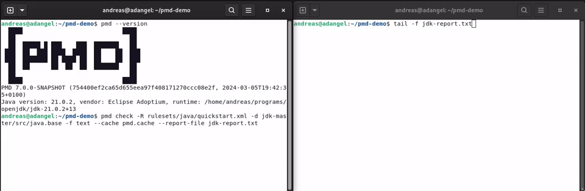

# PMD - source code analyzer

 

**PMD** is an extensible multilanguage static code analyzer. It finds common programming flaws like unused variables,
empty catch blocks, unnecessary object creation, and so forth. It's mainly concerned with **Java and
Apex**, but **supports 16 other languages**. It comes with **400+ built-in rules**. It can be
extended with custom rules. It uses JavaCC and Antlr to parse source files into abstract syntax trees
(AST) and runs rules against them to find violations. Rules can be written in Java or using a XPath query.

Currently, PMD supports Java, JavaScript, Salesforce.com Apex and Visualforce,
Kotlin, Swift, Modelica, PLSQL, Apache Velocity, JSP, WSDL, Maven POM, HTML, XML and XSL.
Scala is supported, but there are currently no Scala rules available.

Additionally, it includes **CPD**, the copy-paste-detector. CPD finds duplicated code in
Coco, C/C++, C#, Dart, Fortran, Gherkin, Go, Groovy, HTML, Java, JavaScript, JSP, Julia, Kotlin,
Lua, Matlab, Modelica, Objective-C, Perl, PHP, PLSQL, Python, Ruby, Salesforce.com Apex and
Visualforce, Scala, Swift, T-SQL, Typescript, Apache Velocity, WSDL, XML and XSL.

## 🚀 Installation and Usage

Download the latest binary zip from the [releases](https://github.com/pmd/pmd/releases/latest)
and extract it somewhere.

Execute `bin/pmd check` or `bin\pmd.bat check`.

See also [Getting Started](https://docs.pmd-code.org/latest/pmd_userdocs_installation.html)

**Demo:**

This shows how PMD analyses [openjdk](https://github.com/openjdk/jdk):

There are plugins for Maven and Gradle as well as for various IDEs.
See [Tools / Integrations](https://docs.pmd-code.org/latest/pmd_userdocs_tools.html)

## ℹ️ How to get support?

*   How do I? -- Ask a question on [StackOverflow](https://stackoverflow.com/questions/tagged/pmd)
    or on [discussions](https://github.com/pmd/pmd/discussions).
*   I got this error, why? -- Ask a question on [StackOverflow](https://stackoverflow.com/questions/tagged/pmd)
    or on [discussions](https://github.com/pmd/pmd/discussions).
*   I got this error and I'm sure it's a bug -- file an [issue](https://github.com/pmd/pmd/issues).
*   I have an idea/request/question -- create a new [discussion](https://github.com/pmd/pmd/discussions).
*   I have a quick question -- ask in our [Gitter room](https://app.gitter.im/#/room/#pmd_pmd:gitter.im).
*   Where's your documentation? -- <https://docs.pmd-code.org/latest/>

## 🤝 Contributing

Pull requests are welcome. For major changes, please open an issue first to discuss what you would like to change.

Our latest source of PMD can be found on [GitHub](https://github.com/pmd/pmd). Fork us!

*   [How to build PMD](BUILDING.md)
*   [How to contribute to PMD](CONTRIBUTING.md)

The rule designer is developed over at [pmd/pmd-designer](https://github.com/pmd/pmd-designer).
Please see [its README](https://github.com/pmd/pmd-designer#contributing) for
developer documentation.

## 💵 Financial Contributors

Become a financial contributor and help us sustain our community. [Contribute](https://opencollective.com/pmd/contribute)

## ✨ Contributors

This project follows the [all-contributors](https://github.com/all-contributors/all-contributors) specification.
Contributions of any kind welcome!

See [credits](docs/pages/pmd/projectdocs/credits.md) for the complete list.

## 📝 License

[BSD Style](LICENSE)
